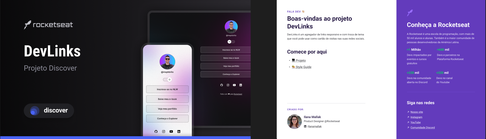
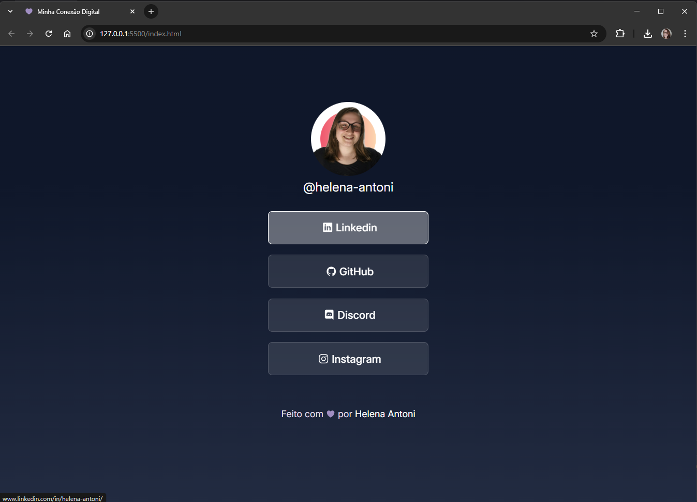

# Minha Conexão Digital 

 ## 📝 Descrição

Este projeto resultado prático dos conceitos de desenvolvimento web aprendidos no curso <a href="https://app.rocketseat.com.br/journey/discover/">Discover</a> da Rocketseat.

A aplicação "Minha Conexão Digital" foi desenvolvida para centralizar minhas principais plataformas de contato e redes sociais em um único lugar. O objetivo é proporcionar uma maneira prática e direta para que qualquer pessoa possa me encontrar online.

## 🚀 Tecnologias Utilizadas

- HTML5
- CSS3
- Git & GitHub

## 🎨 Design do Figma

O design inicial foi inspirado no protótipo do Figma fornecido pela Rocketseat. Fiz alterações na paleta de cores tamanhos e estilo. 

_Clique na imagem para acessar o conteúdo._

<a href="https://www.figma.com/design/YolMhIF7gSna6Gee16ca1c/DevLinks-%E2%80%A2-Projeto-Discover--Community-?node-id=10-620&p=f&t=vf8lEaiWhDGNaQUe-0" >
  </a>

## 🌟 Visualize o Projeto

_Clique na imagem para acessar o site._

## 🤝 Contato e Conexão

Estou sempre disposta a novas conexões, colaborações e desafios! Fique à vontade para se conectar comigo.

_**"A busca pelo aprendizado corre em minhas veias."**_

  <a href="https://github.com/helena-antoni">
    
  </a>
  <a href="https://www.linkedin.com/in/helena-antoni/"  >
    
  </a>
  <a href="mailto:helenaantoni03@gmail.com" >
    
  </a>

