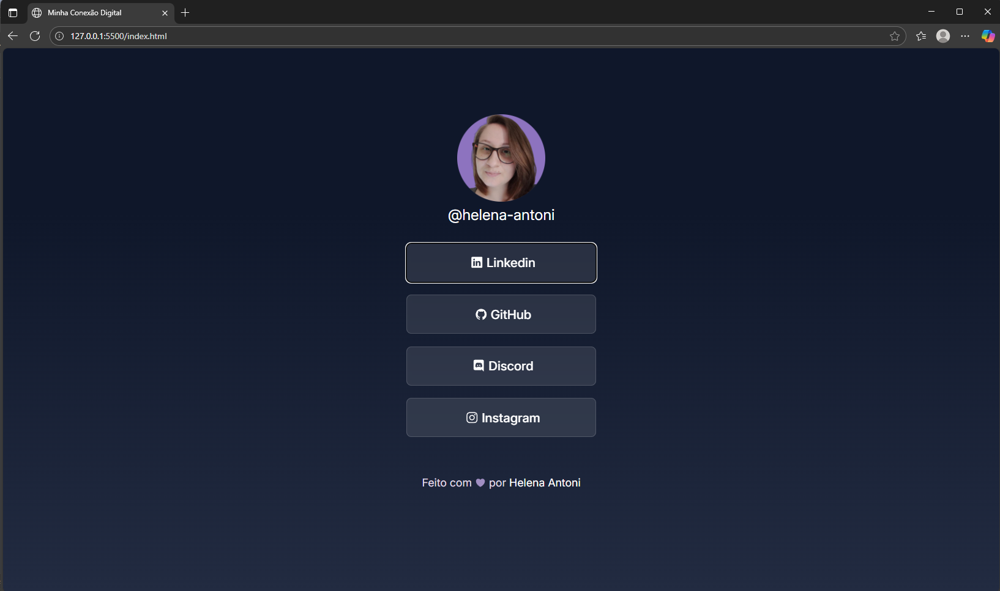

<h1 align="center"> Minha Conexão Digital </h1>

  <a href="#-sobre-o-projeto">Sobre o Projeto</a>&nbsp;&nbsp;&nbsp;|&nbsp;&nbsp;&nbsp;
  <a href="#-tecnologias">Tecnologias</a>&nbsp;&nbsp;&nbsp;|&nbsp;&nbsp;&nbsp;
  <a href="#-design-e-inspiracao">Design e Inspiração</a>&nbsp;&nbsp;&nbsp;|&nbsp;&nbsp;&nbsp;
  <a href="#-visualize-o-projeto">Visualize o Projeto</a>&nbsp;&nbsp;&nbsp;|&nbsp;&nbsp;&nbsp;
  <a href="#memo-licença">Licença</a>

 ## 💻 Sobre o Projeto

Este projeto é um hub de links pessoais, desenvolvido para centralizar minhas principais plataformas de contato e redes sociais em um único lugar. O objetivo é proporcionar uma maneira prática e direta para que qualquer pessoa possa me encontrar online.

Ele foi concebido com uma identidade visual própria, refletindo meu estilo e profissionalismo, e é um resultado prático dos conceitos de desenvolvimento web aprendidos no curso Discover da Rocketseat.

## 🚀 Tecnologias

As seguintes tecnologias foram utilizadas na construção deste projeto:

-   **HTML5:** Para a estrutura semântica da página.
-   **CSS3:** Para a estilização e personalização, incluindo o gradiente de fundo suave e a responsividade.
-   **Git & GitHub:** Para controle de versão e hospedagem do código.

## 🎨 Design e Inspiração

O design inicial foi inspirado no protótipo do Figma fornecido pela Rocketseat. No entanto, fiz questão de adaptá-lo às minhas preferências estéticas, com a escolha de uma paleta de cores que reflete elegantes com azul escuro e ajustes finos na tipografia para uma melhor legibilidade.

Você pode conferir o design original aqui: [DESSE LINK DO FIGMA](https://www.figma.com/community/file/1187422022288947321/devlinks-projeto-discover).
*É necessário ter conta no [Figma](https://figma.com) para acessá-lo.*

## 👁️ Visualize o Projeto

Curioso(a) para ver como ficou? Clique no link abaixo e explore meu hub de links!

[🔗 ACESSE O PROJETO AQUI](https://helena-antoni.github.io/minha-conexao-digital/])

  

## :memo: Licença

Este projeto está sob a licença MIT. Sinta-se à vontade para usá-lo e modificá-lo para seus próprios fins.
